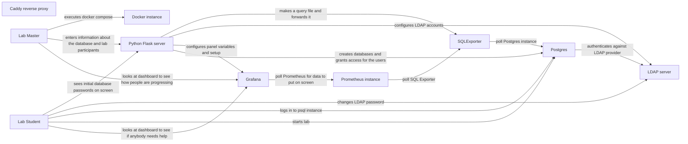
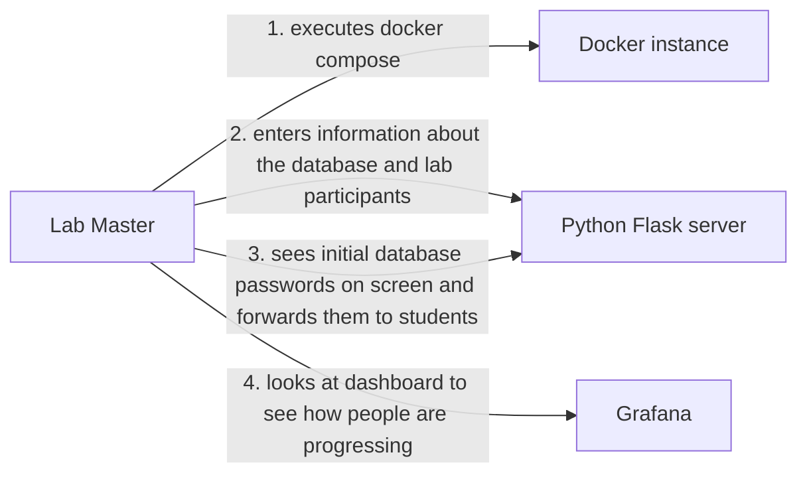
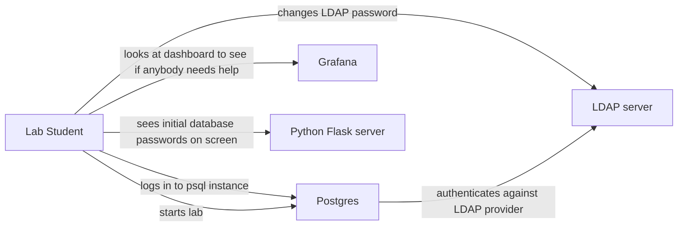

# PGSQL Lab Creator

At university I often times sat in a lab behind a computer with no feeling of order - everybody paced themselves and the ones that needed help were in disarray. Managing a classroom is hard and managing a computer classroom without knowledge who needs help or who is behind is *crippling*. For me, at least. This project:

1. sets up an empty PGSQL instance that everybody can log into and complete a lab
2. sets up automatic monitoring based on some example database and gives feedback on how well the students are progressing

The live demo will be hosted as soon as I have made enough progress on it.

## Architecture

Overall, this is an architecture I have in mind:

### Lab master view

The lab master is the one that sets up the infrastructure and quides people through the lab. His overall activities are infrastructure setup and configuration. His responsibilities end when the participant can access the database and then he can relax and watch the monitoring to see how everybody progresses. The procedure looks like this:

### Lab student view

The lab student must simply log in to the database and begin work. The student can see his progress on the monitoring screen as well as his peers' progress. Depending on the LDAP solution students can get an initial password and change it or use their university authentication source.

